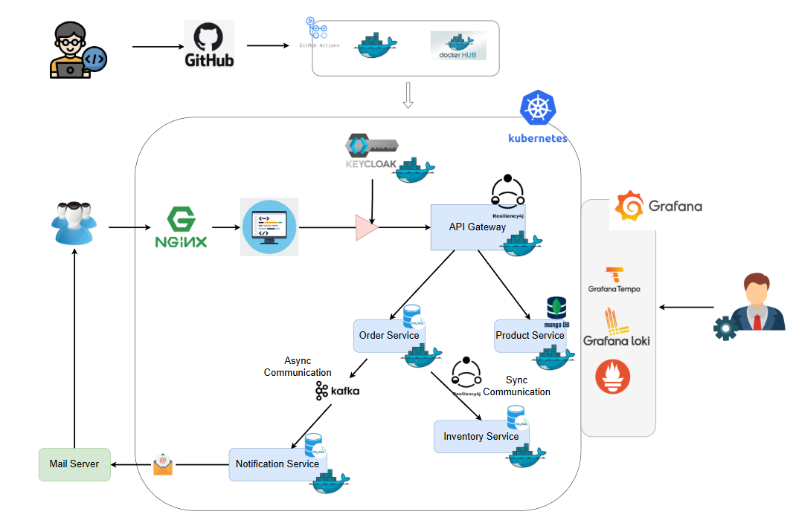

# Cloud-Native Shopping Platform

A microservices-based e-commerce platform built with Spring Boot, Kubernetes, and cloud-native technologies.

## Architecture

**Microservices:**
- API Gateway (routing, authentication)
- Order Service (order processing)  
- Product Service (catalog management - MongoDB)
- Inventory Service (stock management)
- Notification Service (email via Kafka)

**Infrastructure:**
- **Auth:** Keycloak (OAuth2/JWT)
- **Messaging:** Apache Kafka
- **Databases:** MongoDB, MySQL
- **Orchestration:** Kubernetes
- **Monitoring:** Grafana, Prometheus, Loki, Tempo
- **CI/CD:** GitHub Actions + DockerHub

## Quick Start

```bash
# Clone repository
git clone https://github.com/SalindaGunarathna/cloud-project.git
cd cloud-project

# Start infrastructure
docker-compose up -d

# Deploy to Kubernetes
kubectl apply -f k8s/

# Check deployment
kubectl get pods
```

## Local Development

```bash
# Start dependencies
docker-compose up -d mongodb mysql kafka keycloak

# Run services (in separate terminals)
cd order-service && mvn spring-boot:run
cd product-service && mvn spring-boot:run
cd inventory-service && mvn spring-boot:run
cd notification-service && mvn spring-boot:run
cd api-gateway && mvn spring-boot:run
```

## Architecture Diagram




## Key Features

- Independent service scaling
- Event-driven communication (Kafka)
- Circuit breakers & retry mechanisms  
- OAuth2/JWT security
- Full observability stack
- Automated CI/CD pipeline


## Tech Stack

**Backend:** Spring Boot, Spring Data JPA, Resilience4j  
**Databases:** MongoDB, MySQL  
**Infrastructure:** Docker, Kubernetes, NGINX  
**Monitoring:** Prometheus, Grafana, Loki, Tempo

## Team

University of Ruhuna - Department of Computer Engineering  
**Course:** EC7205 Cloud Computing

- EG/2020/3945 - Gunarathne K.M.W.G.S.L.
- EG/2020/4030 - Kumanayake H.P.
- EG/2020/4247 - Udayanthika K.D.S.
- EG/2020/4254 - Virajani M.Y.
