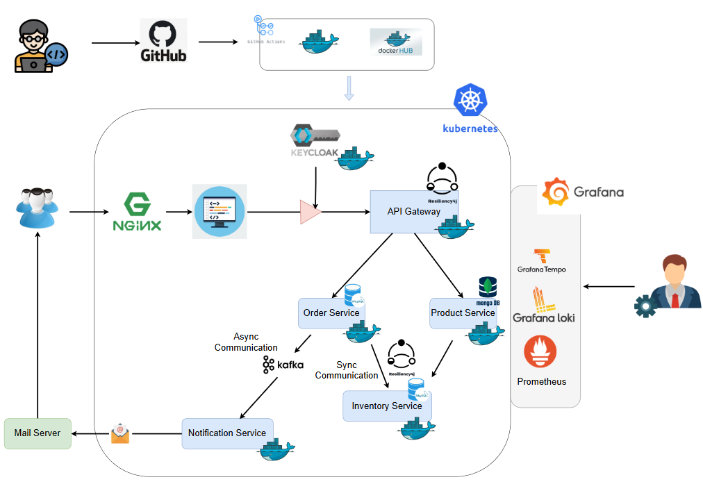

# Online Marketplace Shopping Platform

A microservices-based e-commerce platform built with Spring Boot, Kubernetes, and cloud-native technologies.

## Architecture

**Microservices:**
- API Gateway (routing, authentication)
- Order Service (order processing)  
- Product Service (catalog management - MongoDB)
- Inventory Service (stock management)
- Notification Service (email via Kafka)

**Infrastructure:**
- **Auth:** Keycloak (OAuth2/JWT)
- **Messaging:** Apache Kafka
- **Databases:** MongoDB, MySQL
- **Orchestration:** Kubernetes
- **Monitoring:** Grafana, Prometheus, Loki, Tempo
- **CI/CD:** GitHub Actions + DockerHub
---
## Architecture Diagram



## Key Features

- Independent service scaling
- Event-driven communication (Kafka)
- Circuit breakers & retry mechanisms  
- OAuth2/JWT security
- Full observability stack
- Automated CI/CD pipeline


## Tech Stack

**Backend:** Spring Boot, Spring Data JPA, Resilience4j  
**Databases:** MongoDB, MySQL  
**Infrastructure:** Docker, Kubernetes, NGINX  
**Monitoring:** Prometheus, Grafana, Loki, Tempo
---

## Prerequisites
Make sure you have the following installed before deploying:

- [Docker](https://docs.docker.com/get-docker/)
- [Kind](https://kind.sigs.k8s.io/)
- [kubectl](https://kubernetes.io/docs/tasks/tools/)
- [Git](https://git-scm.com/)

---
## Quick Start

```bash
# Clone repository
git clone https://github.com/SalindaGunarathna/cloud-project.git
cd cloud-project
```

### Start Kind Cluster
    
Run the k8s/kind/create-kind-cluster.sh script to create the kind Kubernetes cluster

```shell
./k8s/kind/create-kind-cluster.sh
```
This will create a kind cluster and pre-load all the required docker images into the cluster, this will save you time downloading the images when you deploy the application.

### Deploy the infrastructure

Run the k8s/manisfests/infrastructure.yaml file to deploy the infrastructure

```shell
kubectl apply -f k8s/manifests/infrastructure/
```

### Deploy the services

Run the k8s/manifests/applications.yaml file to deploy the services

```shell
kubectl apply -f k8s/manifests/applications/
```

### Check deployment
```
kubectl get pods
```
### Port Forwarding
After successful deployment, expose the following services:

- Keycloak
```
kubectl port-forward svc/keycloak 8080:8080
```

- Grafana
```
kubectl port-forward svc/grafana 3000:3000
```

Once Grafana is running, add Prometheus as a data source.
Import the preconfigured dashboard JSON file located at:
```
docker/grafana/dashboard.json
```

## Configuration
### Notification Service (Mailtrap)
The Notification Service uses Mailtrap for testing emails.
Create a [Mailtrap](https://mailtrap.io/)
 account, then create an inbox and configure the following settings:
```
spring.mail.host=sandbox.smtp.mailtrap.io
spring.mail.port=2525
spring.mail.username=578058c92c456a
spring.mail.password=8bd27067c1934f
```
---
## Database Credentials

### MongoDB:

- Username: root

- Password: password

### MySQL:

 - Username: root

 - Password: mysql

---

## Local Development

```bash
# Clone repository
git clone https://github.com/SalindaGunarathna/cloud-project.git
cd cloud-project
```

### How to run the frontend application

Make sure you have the following installed on your machine:

- Node.js
- NPM
- Angular CLI

Run the following commands to start the frontend application

```shell
cd frontend
npm install
npm run start
```
```bash
# Start dependencies
```bash
docker-compose up -d mongodb mysql kafka keycloak
```
### Run services (in separate terminals)
```
cd order-service && mvn spring-boot:run
cd product-service && mvn spring-boot:run
cd inventory-service && mvn spring-boot:run
cd notification-service && mvn spring-boot:run
cd api-gateway && mvn spring-boot:run
```
---


## Team

University of Ruhuna - Department of Computer Engineering  
**Course:** EC7205 Cloud Computing

- EG/2020/3945 - Gunarathne K.M.W.G.S.L.
- EG/2020/4030 - Kumanayake H.P.
- EG/2020/4247 - Udayanthika K.D.S.
- EG/2020/4254 - Virajani M.Y.
